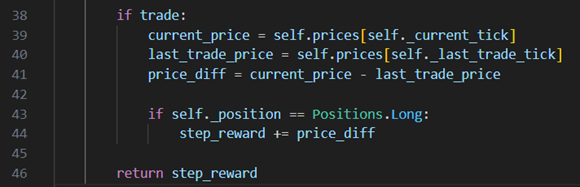

# Áp dụng giải thuật học tăng cường cho thị trường mua bán cổ phiếu

## Tech Stack

**Language:** Python

**Library:** Numpy, Pandas, Matplotlib

## Mô hình
### A.	Giải thuật
A2C (Advantage Actor Critic) là một thuật toán học tăng cường kết hợp giữa các phương pháp Actor-Critic và đồng bộ hóa để đào tạo các mô hình học sâu. Nguyên lý hoạt động của A2C có thể được giải thích như sau:
-	Actor: Là một mô hình mạng nơ-ron chịu trách nhiệm quyết định hành động nào sẽ thực hiện dựa trên trạng thái hiện tại của môi trường. Actor dự đoán một phân phối xác suất cho các hành động có thể được thực hiện.
-	Critic: Là một mô hình mạng nơ-ron khác đánh giá hành động mà Actor đã thực hiện. Critic ước tính giá trị của trạng thái hiện tại (Value Function) hoặc giá trị của cặp trạng thái-hành động (Q-value).
### B.	Action space
Có hai hành động có thể thực hiện: 
-	Sell (0): Hành động này đại diện cho việc bán cổ phiếu. 
-	Buy (1): Hành động này đại diện cho việc mua cổ phiếu.
Bên cạnh đó chúng ta cũng có 2 positions: (Long position) muốn mua cổ phiếu khi giá thấp và kiếm lời bằng cách giữ chúng trong khi giá trị của chúng đang tăng lên, và vị thế bán khống (Short position) muốn bán cổ phiếu với giá cao và sử dụng số tiền đó để mua lại cổ phiếu ở mức giá thấp hơn, giữ lại phần chênh lệch làm lợi nhuận.

### C. Observation space

Hàm observation giúp agent có cái nhìn liên tục về thị trường trong một khoảng thời gian ngắn hạn tùy thuộc vào giới hạn của tham số window_size. Giả sử nếu như window size là 5, điều này có nghĩa là agent sẽ được quan sát biến động của cổ phiếu và các features trong vòng 5 ngày liên tục.

### D. Reward
Hàm reward tính toán phần thưởng dựa trên sự thay đổi giá cổ phiếu và vị thế hiện tại của tác nhân. Nếu tác nhân đang ở vị thế Long và giá cổ phiếu tăng so với lần giao dịch cuối cùng, tác nhân sẽ nhận được phần thưởng dương tương ứng với sự chênh lệch giá. Điều này khuyến khích tác nhân mua khi giá thấp và giữ cho đến khi giá tăng để tối đa hóa lợi nhuận.

## Kết quả

Số vốn ban đầu là : 100.000. Dữ liệu được train trong vòng 100000 timesteps, giao dịch từ 2014 – 2024
Kết quả: 1.606.751 , reward: 1165

**Bonus: kết quả test 1 năm gần nhất**: 206.099

## Authors

- [@minh120103](https://github.com/minh120103)

